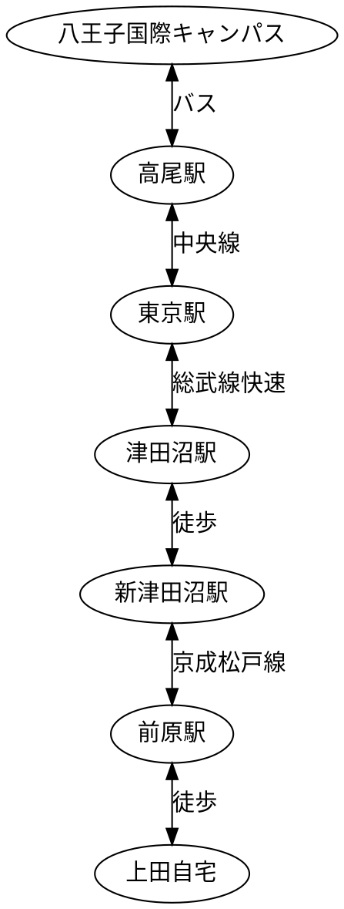

# 上田の通学経路

[メンバー表に戻る](member.md#メンバー表)

```graphviz
digraph {
    edge [dir=both]

    八王子国際キャンパス -> 高尾駅 [label=バス]
    高尾駅 -> 東京駅 [label=中央線]
    東京駅 -> 津田沼駅 [label=総武線快速]
    津田沼駅 -> 新津田沼駅 [label=徒歩]
    新津田沼駅 -> 前原駅 [label=京成松戸線]
    前原駅 -> 上田自宅 [label=徒歩]

}
```
