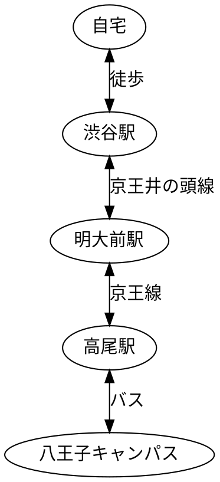

# 関根の通学経路

[メンバー表に戻る](member.md#メンバー表)

```graphviz
digraph {
    edge [dir=both]
    自宅 -> 渋谷駅 [label=徒歩]
    渋谷駅 -> 明大前駅 [label=京王井の頭線]
    明大前駅 -> 高尾駅 [label=京王線]
    高尾駅 -> 八王子キャンパス [label=バス]
}
```
